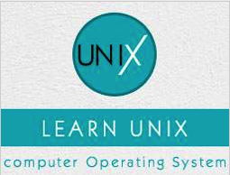

```
Roberto Nogueira  
BSd EE, MSd CE
Solution Integrator Experienced - Certified by Ericsson
```
# TutorialsPoint Unix



**About**

Learn everything you need to about the subject of this `Tutorialspoint` project.

[Homepage](https://www.tutorialspoint.com/unix/index.htm)

## Topics
```
Unix for Beginners
[x] Home
[x] Getting Started
[x] File Management
[x] Directories
[x] File Permission
[x] Environment
[x] Basic Utilities
[x] Pipes & Filters
[x] Processes
[x] Communication
[x] The vi Editor
Unix Shell Programming
[x] What is Shell?
[x] Using Variables
[x] Special Variables
[x] Using Arrays
[x] Basic Operators
[x] Decision Making
[x] Shell Loops
[x] Loop Control
[ ] Shell Substitutions
[ ] Quoting Mechanisms
[ ] IO Redirections
[ ] Shell Functions
[ ] Manpage Help
Advanced Unix
[ ] Regular Expressions
[ ] File System Basics
[ ] User Administration
[ ] System Performance
[ ] System Logging
[ ] Signals and Traps
Unix Useful Resources
[ ] Useful Commands
[ ] Quick Guide
[ ] Builtin Functions
[ ] System Calls
[ ] Commands List
[ ] Useful Resources
[ ] Discussion
Selected Reading
[ ] Developer's Best Practices
[ ] Questions and Answers
[ ] Effective Resume Writing
[ ] HR Interview Questions
[ ] Computer Glossary
[ ] Who is Who
````
 
